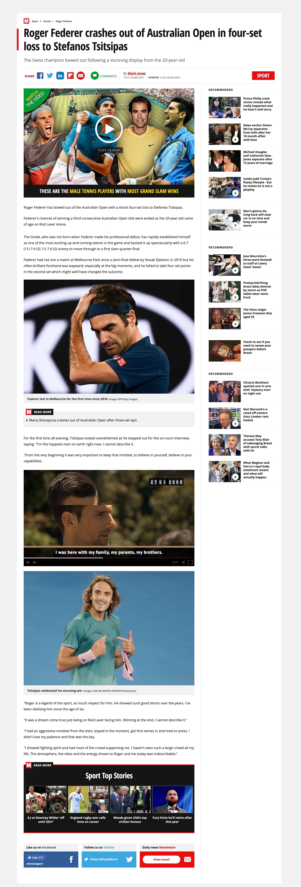

# HTML/CSS S1: Ejercicios

### Ejercicio 1: Restaurant Website (HTML)

Vamos a realizar la página de un restaurante!

Dado el diseño que encontrarás un poco más abajo, realiza el HTML correspondiente. Recuerda que **no es necesario que apliques estilos**, deberás realizar solo el HTML (aunque eres libre de ir mejorándolo con CSS).

Debes ser correcto en el uso de tus etiquetas, recuerda que cada una tiene una finalidad determinada.

Intenta aplicar todas las etiquetas que ya conoces:

- Títulos
- Enlaces
- Imágenes (como elementos HTML, por ahora olvidate de las imágenes de fondo [establece `background-color` diferentes y listo])
- Etiquetas semánticas: article, aside, header, footer...

### Ejercicio 2: Newspaper Article

Desarrolla el HTML de la noticia que encontrarás un poco más abajo, **no es necesario que apliques estilos**, ya que lo más importante es que hagas un uso correcto de la semántica HTML (aunque eres libre de ir mejorándolo con CSS).

Recuerda que la noticia tendrá elementos que entran dentro del contexto de la propia de la noticia, y otros que son ajenos a ella. Intenta recurrir a todos los recursos que ya dispones, para definir la estructura más adecuada.

Recuerda aplicar todos los selectores que conoces:

- Títulos
- Enlaces
- Imágenes (como elementos HTML, por ahora olvidate de las imágenes de fondo [establece `background-color` diferentes y listo])
- Etiquetas semánticas: article, aside, header, footer...

